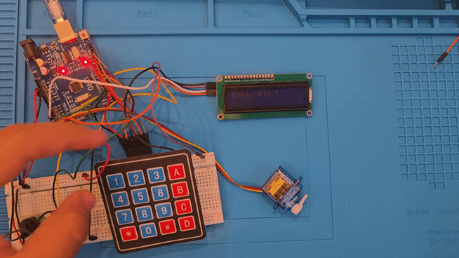
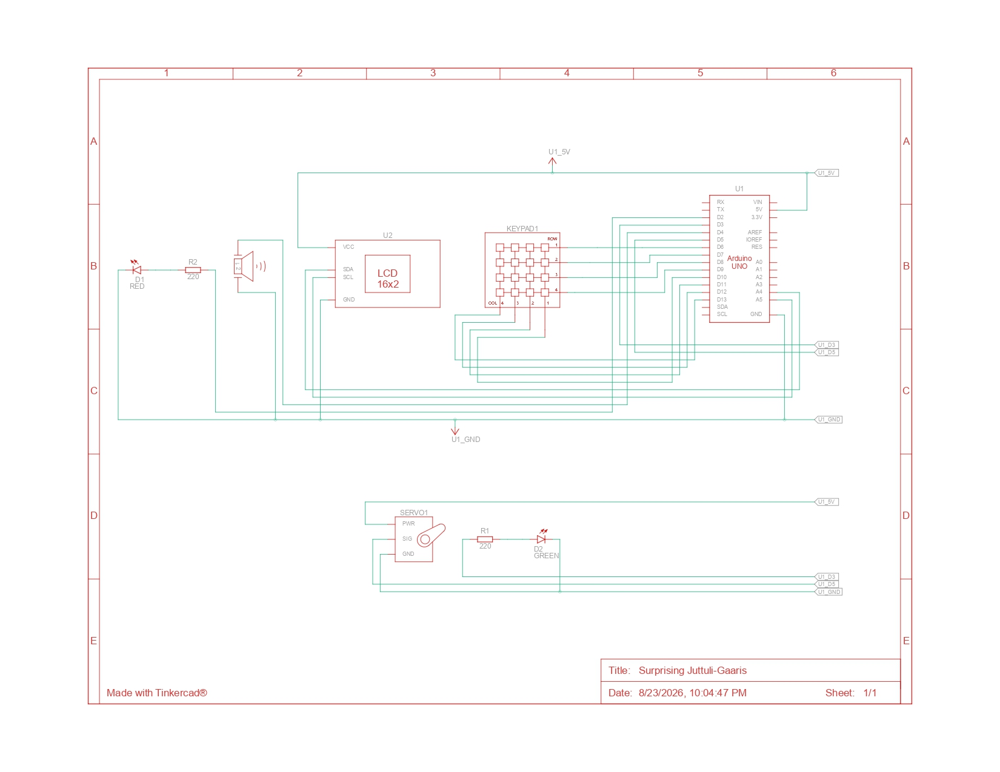
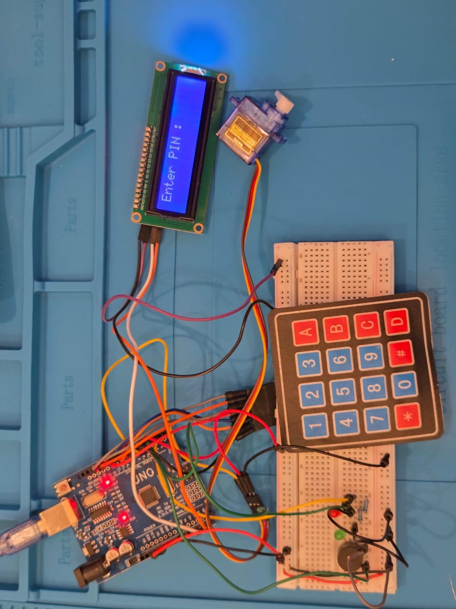

# 🔒 Arduino Security Gate System

An embedded security gate system built with **Arduino Uno**. The system features user authentication via a 4x4 Keypad, visual and audible status feedback, automated gate operation using a Servo motor, and a security lockout mechanism after multiple failed password attempts.

## 🎬 Project Demo



---

## 📌 Features

* **PIN Authentication**: Secure 4-digit password entry with input masking (`****`).
* **Automated Servo Gate**: Rotates 90° upon entering the correct PIN and automatically closes after 5 seconds.
* **Security Lockout Mechanism**: After **3 consecutive failed attempts**, the system locks down for **15 seconds** with visual (LED) and audible (Buzzer) alarm indicators.
* **Interactive Display**: Real-time status updates provided on a 16x2 I2C LCD screen.
* **Keypad Controls**:
  * `0-9`: Digit input
  * `#`: Submit PIN
  * `*`: Clear/Reset input

---

## 🛠️ Hardware Requirements

| Component | Quantity | Notes |
| :--- | :--- | :--- |
| **Arduino Uno** | 1 | Microcontroller Board |
| **4x4 Matrix Keypad** | 1 | User Input Interface |
| **LCD 16x2 (with I2C Module)** | 1 | Display Output (`0x27` address) |
| **SG90 Servo Motor** | 1 | Gate Actuator |
| **Red LED** | 1 | Error & Lockout Indicator |
| **Green LED** | 1 | Access Granted Indicator |
| **Active Buzzer** | 1 | Audible Feedback & Alarm |
| **220Ω Resistors** | 2 | Current Limiters for LEDs |
| **Breadboard & Jumper Wires** | — | Circuit Connections |

---

## 🔌 Circuit Pinout Connections

### **1. Keypad 4x4**
* **Rows (1 - 4)** $\rightarrow$ Arduino Pins **`6`, `7`, `8`, `9`**
* **Columns (1 - 4)** $\rightarrow$ Arduino Pins **`10`, `11`, `12`, `13`**

### **2. I2C LCD 16x2**
* **VCC** $\rightarrow$ **`5V`**
* **GND** $\rightarrow$ **`GND`**
* **SDA** $\rightarrow$ Analog Pin **`A4`**
* **SCL** $\rightarrow$ Analog Pin **`A5`**

### **3. Actuators & Indicators**
* **Servo Motor (Signal)** $\rightarrow$ Digital Pin **`5`**
* **Red LED** $\rightarrow$ Digital Pin **`2`** (via 220Ω resistor)
* **Green LED** $\rightarrow$ Digital Pin **`3`** (via 220Ω resistor)
* **Active Buzzer** $\rightarrow$ Digital Pin **`4`**

---

## 📐 Circuit Diagrams & Setup

| 2D Schematic (Tinkercad) | Real Hardware Setup |
| :---: | :---: |
|  |  |

* 📄 Download Bill of Materials: [components.csv](schematics/components.csv)
* 🌐 Live Simulation: [Tinkercad Link](schematics/simulation_link.txt) 

---

## 📂 Project Structure

```text
Arduino-Security-Gate/
├── .gitignore
├── README.md
├── src/
│   └── main.ino
└── schematics/
    ├── circuit_diagram.jpg
    ├── circuit_real.jpeg
    ├── components.csv
    ├── demo.gif
    ├── demo.mp4
    └── simulation_link.txt
---

## 🚀 How to Run & Setup

1. **Hardware Assembly**: Connect all hardware components according to the **Circuit Pinout Connections** table above.
2. **Install Required Libraries**: Open **Arduino IDE**, navigate to **Tools > Manage Libraries**, and install the following:
   * `Keypad` (by Mark Stanley, Alexander Brevig)
   * `LiquidCrystal_I2C` (by Frank de Brabander)
3. **Upload Code**:
   * Connect your Arduino Uno board to your computer via USB.
   * Open `src/main.ino` in Arduino IDE.
   * Select **Arduino Uno** and your corresponding **COM Port** under **Tools**.
   * Click **Upload**.
4. **Tinkercad Simulation**: You can test and inspect the live circuit online via our [Tinkercad Simulation Link](schematics/simulation_link.txt).

---

## 💻 Source Code (`src/main.ino`)

```cpp
#include <Servo.h>
#include <Wire.h> 
#include <LiquidCrystal_I2C.h>
#include <Keypad.h>

// LCD Setup (16x2 Display at address 0x27)
LiquidCrystal_I2C lcd(0x27, 16, 2); 

// Pin Definitions
const int redLed = 2;
const int greenLed = 3;
const int buzzer = 4;
const int servoPin = 5;

// Keypad Configuration
const byte ROWS = 4;
const byte COLS = 4;
char keys[ROWS][COLS] = {
  {'1','2','3','A'},
  {'4','5','6','B'},
  {'7','8','9','C'},
  {'*','0','#','D'}
};
byte rowPins[ROWS] = {6, 7, 8, 9};
byte colPins[COLS] = {10, 11, 12, 13};

Keypad keypad = Keypad(makeKeymap(keys), rowPins, colPins, ROWS, COLS);
Servo myservo;

// System Variables
const String Password = "1234";
String inputPin = "";
byte failedPassword = 0;

// Function Declarations
void resetUI();
void checkPassword();
void lockoutSystem();

void setup() {
  myservo.attach(servoPin);
  myservo.write(0); // Ensure gate starts closed

  pinMode(redLed, OUTPUT);
  pinMode(greenLed, OUTPUT);
  pinMode(buzzer, OUTPUT);

  Serial.begin(9600);
  
  Wire.begin();
  lcd.begin(16, 2);
  lcd.backlight();

  resetUI();
}

void loop() {
  char key = keypad.getKey();

  if (key) {
    if (key >= '0' && key <= '9') {
      if (inputPin.length() < 4) {
        inputPin += key;
        lcd.print("*");
      }
    }
    else if (key == '#') {
      checkPassword();
    }
    else if (key == '*') {
      resetUI();
    } 
  }
}

void resetUI() {
  inputPin = "";
  digitalWrite(redLed, LOW);
  digitalWrite(greenLed, LOW);
  digitalWrite(buzzer, LOW);

  lcd.clear();
  lcd.setCursor(0, 0);
  lcd.print("Enter PIN :");
  lcd.setCursor(0, 1);
}

void checkPassword() {
  if (inputPin == Password) {
    lcd.clear();
    lcd.setCursor(0, 0);
    lcd.print("Access Granted!");

    digitalWrite(greenLed, HIGH);
    myservo.write(90); // Open gate
    
    delay(5000);

    myservo.write(0);  // Close gate
    resetUI();
  }
  else {
    failedPassword++;

    lcd.clear();
    lcd.setCursor(0, 0);
    lcd.print("Wrong Password!");
    digitalWrite(redLed, HIGH);

    digitalWrite(buzzer, HIGH);
    delay(500);
    digitalWrite(buzzer, LOW);
    delay(1000);

    if (failedPassword >= 3) {
      lockoutSystem();
    }
    else {
      resetUI();
    }
  }
}

void lockoutSystem() {
  lcd.clear();
  lcd.setCursor(0, 0);
  lcd.print("SYSTEM LOCKED!");
  
  for (int i = 15; i >= 0; i--) {
    lcd.setCursor(0, 1);
    lcd.print("Wait: ");
    lcd.print(i);
    lcd.print("s ");

    digitalWrite(redLed, !digitalRead(redLed)); // Toggle Red LED
    digitalWrite(buzzer, HIGH);
    delay(200);
    digitalWrite(buzzer, LOW);
    delay(800);
  }

  failedPassword = 0;
  resetUI();
}